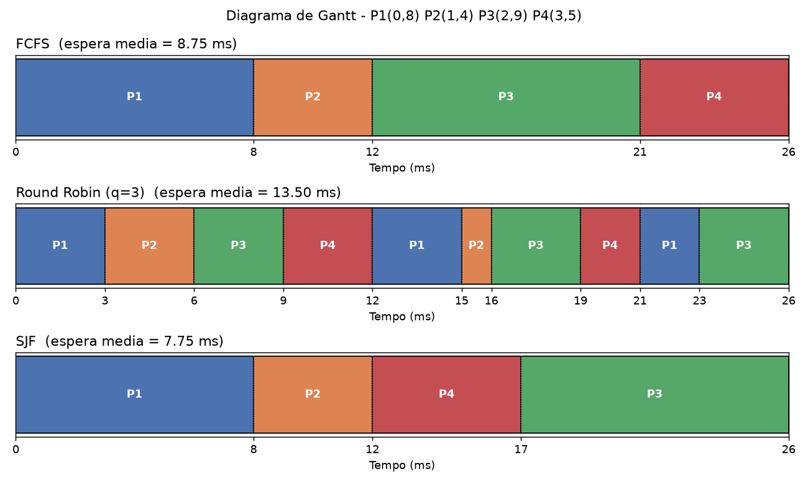
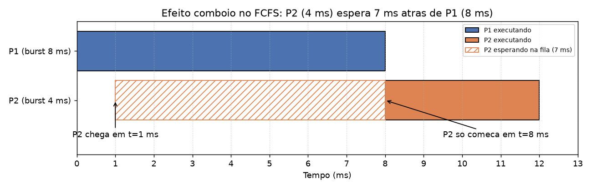
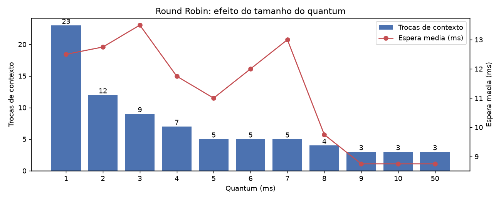
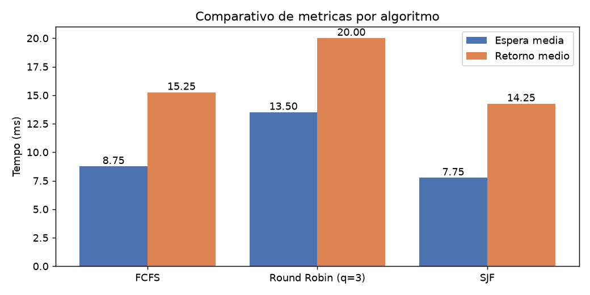

# Laboratório 02 — Simulação de Algoritmos de Escalonamento de CPU

**Disciplina:** Sistemas Operacionais (2026.2) — 4º Semestre, ADS / UNIFADESA
**Docente:** Prof. Esp. Rodrigo Martins Sousa
**Avaliação:** 1,0 ponto na N1 — Entrega até 01/10/2026
**Aluno(a):** Marcelo Rosa

---

## 1. Objetivo

Simular e comparar três algoritmos de escalonamento de CPU — **FCFS**, **Round Robin** e
**SJF** — sobre a mesma carga de trabalho, medindo o **tempo de espera**, o **tempo de retorno**
(*turnaround*) e a quantidade de **trocas de contexto** de cada um.

## 2. Cenário de teste

| Processo | Chegada | Burst | Prioridade |
|:--------:|:-------:|:-----:|:----------:|
| P1 | 0 ms | 8 ms | 3 |
| P2 | 1 ms | 4 ms | 1 |
| P3 | 2 ms | 9 ms | 4 |
| P4 | 3 ms | 5 ms | 2 |

Definições usadas em todo o laboratório:

- **Retorno** = Finalização − Chegada
- **Espera** = Retorno − Burst (tempo que o processo ficou pronto, mas fora da CPU)
- **Troca de contexto** = cada vez que a CPU passa de um processo para **outro** processo
  (o primeiro despacho, com a CPU ociosa, não conta).

## 3. Estrutura do repositório

```
.
├── simulador_escalonador.py   # Simulador do roteiro (FCFS, RR) + SJF, Gantt e trocas de contexto
├── gerar_graficos.py          # Gera os gráficos em graficos/ (matplotlib)
├── executar_tudo.sh           # Roda o simulador e os gráficos e salva as evidências
├── graficos/
│   ├── 1_gantt_comparativo.png
│   ├── 2_efeito_comboio.png
│   ├── 3_quantum_trocas.png
│   └── 4_medias_comparativo.png
├── evidencias/
│   ├── saida_simulador.txt    # Log completo do simulador (FCFS, RR q=3, SJF, RR q=1, RR q=50)
│   └── saida_graficos.txt     # Tabela quantum x trocas de contexto x espera média
└── README.md
```

O `simulador_escalonador.py` mantém o código do roteiro (classe `Processo`,
`simular_fcfs` e `simular_round_robin`) e acrescenta:

- `simular_sjf` — SJF não-preemptivo, usado para **conferir** a resolução manual da Questão 3;
- registro da linha do tempo e impressão de um **diagrama de Gantt em texto**;
- contagem de **trocas de contexto** (Questão 2);
- quantum configurável pela linha de comando.

## 4. Como executar

```bash
pip install matplotlib        # necessário apenas para os gráficos
bash executar_tudo.sh
```

Ou individualmente:

```bash
python3 simulador_escalonador.py          # FCFS, RR (q=3) e SJF
python3 simulador_escalonador.py 1 50     # também roda RR com q=1 e q=50
python3 gerar_graficos.py
```

## 5. Resultados da execução

Saída do simulador ([`evidencias/saida_simulador.txt`](evidencias/saida_simulador.txt)):

```
--- SIMULACAO FCFS ---
Proc P1: Fim=8ms, Espera=0ms, Retorno=8ms
Proc P2: Fim=12ms, Espera=7ms, Retorno=11ms
Proc P3: Fim=21ms, Espera=10ms, Retorno=19ms
Proc P4: Fim=26ms, Espera=18ms, Retorno=23ms
Tempo Medio de Espera:  8.75 ms
Tempo Medio de Retorno: 15.25 ms
Trocas de contexto: 3
Gantt: |-----------P1----------|-----P2----|------------P3------------|------P4------|
       0                       8          12                         21             26

--- SIMULACAO ROUND ROBIN (Quantum = 3ms) ---
Proc P1: Fim=23ms, Espera=15ms, Retorno=23ms
Proc P2: Fim=16ms, Espera=11ms, Retorno=15ms
Proc P3: Fim=26ms, Espera=15ms, Retorno=24ms
Proc P4: Fim=21ms, Espera=13ms, Retorno=18ms
Tempo Medio de Espera:  13.50 ms
Tempo Medio de Retorno: 20.00 ms
Trocas de contexto: 9
Gantt: |---P1---|---P2---|---P3---|---P4---|---P1---|P2|---P3---|--P4-|--P1-|---P3---|
       0        3        6        9       12       15 16       19    21    23       26

--- SIMULACAO SJF (nao-preemptivo) ---
Proc P1: Fim=8ms, Espera=0ms, Retorno=8ms
Proc P2: Fim=12ms, Espera=7ms, Retorno=11ms
Proc P3: Fim=26ms, Espera=15ms, Retorno=24ms
Proc P4: Fim=17ms, Espera=9ms, Retorno=14ms
Tempo Medio de Espera:  7.75 ms
Tempo Medio de Retorno: 14.25 ms
Trocas de contexto: 3
Gantt: |-----------P1----------|-----P2----|------P4------|------------P3------------|
       0                       8          12             17                         26
```



---

## 6. Respostas às questões

### Questão 1 — Efeito Comboio

No FCFS a CPU é entregue por ordem de chegada e **não há preempção**. P1 chega em `t = 0`
com um burst longo (8 ms) e ocupa o processador até `t = 8`. P2, que chega logo depois
(`t = 1`) e precisaria de apenas 4 ms, fica parado na fila de prontos durante todo esse tempo:



```
Tempo:  0   1   2   3   4   5   6   7   8   9  10  11  12
CPU  :  [============== P1 ==============][==== P2 ====]
P2   :      ^ chega   . . . esperando . . . ^ executa
            t=1                             t=8
```

| P2 no FCFS | Valor |
|---|---|
| Chegada | 1 ms |
| Início da execução | 8 ms |
| **Espera** | 8 − 1 = **7 ms** |
| Retorno | 12 − 1 = 11 ms |

P2 passou **7 ms esperando para executar 4 ms**: o tempo de espera é 1,75 vez o próprio burst,
e o retorno (11 ms) é quase o triplo do trabalho útil. Esse é o **efeito comboio**: processos
curtos ficam "presos" atrás de um processo longo, como carros atrás de um caminhão numa estrada
de uma faixa. O efeito se propaga pela fila — P3 espera 10 ms e P4 espera 18 ms —, o que leva o
FCFS a uma espera média de 8,75 ms.

No Round Robin (q = 3), P1 é interrompido em `t = 3` e P2 começa a executar logo em seguida:
P2 espera apenas **2 ms** pela primeira fatia de CPU, em vez de 7 ms. É por isso que algoritmos
preemptivos são preferidos em sistemas interativos — uma requisição leve de uma API não fica
bloqueada atrás de uma requisição pesada.

### Questão 2 — Variação do Quantum

O simulador foi executado com vários valores de quantum
([`evidencias/saida_graficos.txt`](evidencias/saida_graficos.txt)):

| Quantum | Trocas de contexto | Espera média | Retorno médio |
|:-------:|:------------------:|:------------:|:-------------:|
| **1 ms** | **23** | 12,50 ms | 19,00 ms |
| 2 ms | 12 | 12,75 ms | 19,25 ms |
| **3 ms** (roteiro) | **9** | 13,50 ms | 20,00 ms |
| 5 ms | 5 | 11,00 ms | 17,50 ms |
| 9 ms | 3 | 8,75 ms | 15,25 ms |
| **50 ms** | **3** | 8,75 ms | 15,25 ms |



**Quantum reduzido para 1 ms:** as trocas de contexto sobem de 9 para **23** (mais que o
dobro). Com fatias tão pequenas, a CPU alterna entre os processos praticamente a cada
milissegundo (`P1 P2 P1 P3 P2 P4 P1 P3 ...`). O ganho é a **responsividade**: todo processo
recebe a CPU logo depois de chegar. O custo é o **overhead**: cada troca exige salvar e
restaurar registradores e o contador de programa no PCB, além de invalidar caches e a TLB.
O simulador considera a troca instantânea; num sistema real, com uma troca custando uma fração
do quantum, uma parte relevante do tempo de CPU seria gasta só trocando de processo, sem
trabalho útil.

**Quantum aumentado para 50 ms:** as trocas caem para **3**, o mínimo possível para 4
processos. Como 50 ms é maior que o maior burst (P3 = 9 ms), nenhum processo é interrompido:
cada um executa do início ao fim assim que chega sua vez. O Round Robin **degenera em FCFS** —
os resultados são idênticos (espera média de 8,75 ms, retorno médio de 15,25 ms, mesmo Gantt)
e o efeito comboio da Questão 1 volta a acontecer.

**Conclusão:** o quantum precisa equilibrar os dois extremos. Pequeno demais desperdiça CPU com
trocas de contexto; grande demais elimina a preempção e a responsividade. Na prática, ele deve
ser grande em relação ao custo da troca de contexto e maior que a maioria dos bursts curtos
(regra prática: cerca de 80% dos bursts devem caber em um quantum).

### Questão 3 — Resolução Manual do SJF (não-preemptivo)

No SJF não-preemptivo, quando a CPU fica livre, o escalonador escolhe, **entre os processos que
já chegaram**, aquele com o **menor burst**, e o executa até o fim.

**Passo a passo:**

1. **t = 0:** só P1 chegou → P1 executa de 0 a 8 (sem preempção, mesmo com outros chegando).
2. **t = 8:** prontos P2 (4 ms), P3 (9 ms), P4 (5 ms) → menor burst: **P2**, de 8 a 12.
3. **t = 12:** prontos P3 (9 ms), P4 (5 ms) → menor burst: **P4**, de 12 a 17.
4. **t = 17:** resta P3 → executa de 17 a 26.

```
| P1 (0-8) | P2 (8-12) | P4 (12-17) | P3 (17-26) |
0          8           12           17           26
```

**Cálculo:**

| Processo | Chegada | Burst | Início | Fim | Retorno (Fim − Chegada) | Espera (Retorno − Burst) |
|:--:|:--:|:--:|:--:|:--:|:--:|:--:|
| P1 | 0 | 8 | 0 | 8 | 8 − 0 = **8** | 8 − 8 = **0** |
| P2 | 1 | 4 | 8 | 12 | 12 − 1 = **11** | 11 − 4 = **7** |
| P3 | 2 | 9 | 17 | 26 | 26 − 2 = **24** | 24 − 9 = **15** |
| P4 | 3 | 5 | 12 | 17 | 17 − 3 = **14** | 14 − 5 = **9** |

- **Tempo médio de espera** = (0 + 7 + 15 + 9) / 4 = 31 / 4 = **7,75 ms**
- **Tempo médio de retorno** = (8 + 11 + 24 + 14) / 4 = 57 / 4 = **14,25 ms**

A função `simular_sjf` do simulador chega exatamente aos mesmos valores (seção 5).

**Comparação:**

| Algoritmo | Espera média | Retorno médio | Trocas de contexto | Tempo médio até a 1ª execução* |
|---|:--:|:--:|:--:|:--:|
| FCFS | 8,75 ms | 15,25 ms | 3 | 8,75 ms |
| Round Robin (q = 3) | 13,50 ms | 20,00 ms | 9 | **3,00 ms** |
| **SJF** | **7,75 ms** | **14,25 ms** | 3 | 7,75 ms |

\* Tempo de resposta: do momento da chegada até a primeira vez que o processo recebe a CPU.
No RR: P1 = 0, P2 = 3 − 1 = 2, P3 = 6 − 2 = 4, P4 = 9 − 3 = 6 → média 3 ms.



- **SJF** teve o **menor** tempo médio de espera e de retorno. A diferença em relação ao FCFS
  está só na ordem de P3 e P4: ao executar P4 (5 ms) antes de P3 (9 ms), P4 deixa de esperar
  18 ms e passa a esperar 9 ms, enquanto P3 espera 5 ms a mais (15 ms). Colocar os jobs curtos
  antes reduz a soma das esperas — por isso o SJF é **ótimo** em espera média entre os
  algoritmos não-preemptivos. Ele não eliminou o comboio de P1 porque, em `t = 0`, P1 era o
  único processo pronto e, sem preempção, não pôde ser interrompido.
- **FCFS** ficou em posição intermediária neste cenário, mas sofre com o efeito comboio: o
  resultado depende inteiramente da ordem de chegada.
- **Round Robin** teve as **piores** médias de espera e retorno (13,50 ms e 20,00 ms), porque
  intercala todos os processos e adia a conclusão de cada um, e ainda fez 9 trocas de contexto.
  Em compensação, foi de longe o **mais responsivo**: em média, cada processo recebeu a CPU 3 ms
  após chegar, contra 7,75–8,75 ms nos outros dois.

**Ressalvas do SJF:** ele exige conhecer a duração do próximo burst, o que um sistema real não
sabe de antemão (na prática ela é estimada, por exemplo por média exponencial dos bursts
anteriores). Ele também pode causar **inanição** (*starvation*): se processos curtos continuarem
chegando, um processo longo como P3 pode ser adiado indefinidamente.

**Resumo:** SJF minimiza a espera média, Round Robin maximiza a responsividade às custas de mais
trocas de contexto, e FCFS é o mais simples, mas o mais sensível à ordem de chegada.
